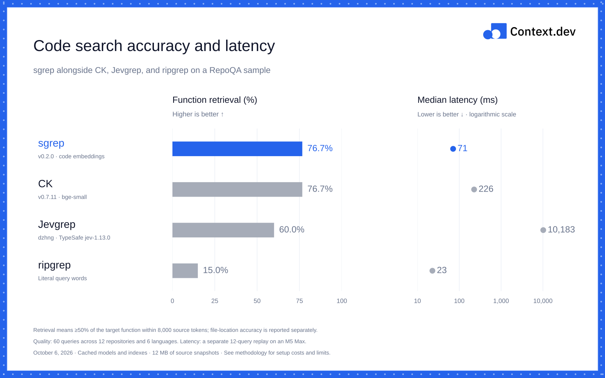

<p align="center">
  <a href="https://context.dev">
    <picture>
      <source media="(prefers-color-scheme: dark)" srcset="assets/context-logo-white.svg">
      
    </picture>
  </a>
</p>

<h1 align="center">sgrep</h1>

<p align="center"><strong>Search code and documents with ripgrep and local static embeddings.</strong></p>

<p align="center">
  <a href="#benchmarks">Benchmarks</a> ·
  <a href="https://github.com/mrmps/sgrep/releases">Releases</a> ·
  <a href="https://context.dev">Context.dev</a>
</p>

sgrep searches fresh source with independent lexical and semantic retrieval, including passages that share none of your question's words. It can also rank the output of your own ripgrep command. Everything runs locally; a persistent index reuses chunks, lexical statistics, and embeddings after checking the current file list and metadata.

## Benchmarks

Indexed discovery measured **62 ms** on a 2,545-file Context snapshot; piped reranking measured **43 ms**, including ripgrep. These are warm local measurements; [cold costs, exact output parity, and before/after results](benchmarks/README.md#indexed-discovery-latency-october-9) are reported separately.



The hybrid-fusion baseline, before independent semantic discovery, improved complete-function retrieval from **507/600 to 533/600** on the full local RepoQA retrieval suite, compared with current main. Median CLI latency on the separate replay panel was **81 → 69 ms**. There were 32 function-retrieval gains and six losses; see the [before/after results and limitations](benchmarks/README.md#live-hybrid-fusion-before-and-after). The discovery and stdin changes have a separate [60-query comparison](benchmarks/README.md#discovery-and-piped-reranking-october-9).

The chart above is the earlier published v0.2.0 comparison: sgrep matched CK's 76.7% function-retrieval rate at 71 ms median latency on 60 queries. Jevgrep was best at ranking the correct file first, while CK returned complete functions more often. These source-snapshot results do not establish large-monorepo or general-document performance.

See the [full results and methodology](benchmarks/README.md), including the exact metric, per-query scores, setup costs, and limitations. The earlier Rust rewrite reduced median latency from 397 ms to 74 ms while preserving all 100 Python-query rankings.

## Install

```sh
brew install ripgrep # or use your package manager
cargo install --git https://github.com/mrmps/sgrep --locked
```

Building requires Rust 1.90 or later. You can also download a [macOS Apple Silicon binary](https://github.com/mrmps/sgrep/releases/latest). The executable needs ripgrep on your PATH, but no Python runtime or API key.

If you installed the earlier Python package, remove it with `uv tool uninstall sgrep` or `pip uninstall sgrep` first.

## Usage

```sh
sgrep "when does a failed scrape consume credits" ./src

rg --json -C 3 'creditCost|shouldBill' ./src \
  | sgrep "when does a failed scrape consume credits" --stdin
```

`--stdin` ranks **only** the supplied match/context blocks. It does not scan the repository or add discovery results. Run both commands from the same directory; an optional path limits which input files are accepted. Empty input returns `[]` with `--json` and exit code 1. Use `-n` to choose the number of passages and `--json` for structured output.

Discovery returns approximate matches even when no query words occur. A result is not proof that the code implements the requested behavior; inspect the source. Use ripgrep when you need exact-match absence checks.

You can add matches from an independently chosen ripgrep command. Run both commands from the same directory; emitted paths must fall within the sgrep search scope. Ripgrep still controls its regexes, globs, case handling and context:

```sh
rg --json -i -C 12 -e 'single.?flight|in.?flight|coalesc' ./src \
  | sgrep "where do identical concurrent requests share work" ./src --rg-json -
```

`--rg-json FILE` also accepts saved output. These context blocks join the independently retrieved lexical and semantic candidates, even if they contain none of the question's words. Duplicate locations are scored once. Supplemental matches can explicitly include ignored or hidden files; the default BM25 scan still respects ignore rules. Stale source or paths outside the requested scope produce an error. Ripgrep JSON paths are resolved from the current working directory, including when reading saved output.

Use `--json --explain` to inspect raw BM25 and semantic scores, their normalized values, and the final fused score. Existing JSON output is unchanged without `--explain`.

The default `--model auto` uses general-text embeddings when every eligible passage is a prose file (`.md`, `.mdx`, `.txt`, `.rst`, `.adoc`, `.org`, or `.text`, case-insensitive). Code, mixed candidates, and other file types use code embeddings. You can choose explicitly when a file extension does not reflect its contents:

```sh
sgrep "how do refunds work" . --model text
sgrep "retry with exponential backoff" . --model code
```

Each model downloads about 32–34 MB on first use and works offline afterward. Code search also downloads and caches the required Tree-sitter grammars on first use. Your source and queries stay local. Existing Hugging Face caches are reused, and `HF_HUB_OFFLINE=1` prevents downloads.

Directory searches follow ripgrep's ignore rules and skip hidden and binary files. Results include relative paths, one-based line ranges, and source. Exit codes are `0` for results, `1` for no matches, and `2` for errors.

The search index lives in `$SGREP_CACHE_DIR`, `$XDG_CACHE_HOME/sgrep`, or `~/.cache/sgrep`, in that order. It contains **source passages**, lexical postings, and vectors. Files are written atomically with private permissions on Unix; source copies remain there until you delete the cache. `--no-cache` disables index reads and writes. Corrupt indexes are rebuilt, and deleting them is safe. No daemon or manual indexing command is required. Piped reranking does not use this index.

Warm discovery enumerates files with ripgrep, checks file size, modification time, inode and change time on Unix, then memory-maps the index. Other platforms also hash source content. Additions, deletions, ignore changes, edits, and model changes invalidate the index. First searches and searches after edits rebuild the entire scope; they are not covered by warm-search latency measurements. Use `--no-cache` on filesystems that do not reliably update metadata.

## How it works

Ripgrep enumerates eligible files, and Rust reads and chunks them in parallel. BM25 uses statistics from the whole live corpus rather than files selected by natural-language words. Code uses a Rust port of Chonkie 1.7.0 CodeChunker with the exact boundary algorithm from Tree-sitter language-pack 1.21.0, the same pinned grammars, character tokenizer, and 2,048-character size estimate. It skips metadata that CodeChunker discards and avoids parsing files that already fit in one chunk. Supported extensions cover Python, C/C++, Go, Java, Rust, JavaScript/JSX, and TypeScript/TSX. Other files use Rust Chonkie RecursiveChunker with a 2,048-character target. Chunk boundaries expand to whole source lines, so a long line can exceed that target. Discovery takes the union of the top 200 BM25 passages and top 200 semantic passages, then adds any `--rg-json` blocks. Semantic retrieval considers every eligible passage independently of lexical scores. Each embedding includes the relative path and complete chunk text; tokenizer padding and truncation are disabled. `--stdin` skips discovery and scores only supplied blocks.

[Relative score fusion](https://docs.weaviate.io/weaviate/concepts/search/hybrid-search) scales each candidate's BM25 and semantic scores to 0–1 within that candidate pool and averages them equally. This preserves score gaps that rank-only fusion loses: a standout BM25 result can outrank a semantically stronger but lexically weak passage. A flat score distribution contributes zero; ties favor the higher raw BM25 score. This is not a hard pin or a global confidence threshold, and changing the candidate pool can change the normalization. Results wholly contained in an earlier result are omitted; partial overlaps retain their unique source.

The index preserves the same chunks and scores as uncached search. A warm query scores matching lexical postings and materializes selected source passages; semantic retrieval still scans every vector. Embedding loads decode only token rows used by the current batch. Piped reranking embeds the query and supplied passages in one batch.

The embeddings come from **[Minish Lab](https://github.com/MinishLab)**, the team behind [Model2Vec](https://github.com/MinishLab/model2vec): [Potion Code 16M v2](https://huggingface.co/minishlab/potion-code-16M-v2) for code and [Potion Base 8M](https://huggingface.co/minishlab/potion-base-8M) for general English text. Both models are MIT-licensed and pinned to specific revisions.

## Alternatives

| Project | Approach |
| --- | --- |
| [ripgrep](https://github.com/BurntSushi/ripgrep) | Fast literal and regular-expression search when you know what to match. |
| [CK](https://github.com/BeaconBay/ck) | Local semantic and hybrid code search with a persistent index. |
| [Jevgrep](https://github.com/dzhng/jevgrep) | Model-guided repository search using Jev through TypeSafe. |

## Development

```sh
cargo build --release --locked
PATH="$PWD/target/release:$PATH" python3 tests/e2e.py > e2e-results.json
PATH="$PWD/target/release:$PATH" python3 tests/codechunker.py > chunker-results.json
PATH="$PWD/target/release:$PATH" python3 tests/hybrid.py > hybrid-results.json
PATH="$PWD/target/release:$PATH" python3 tests/discovery.py > discovery-results.json
SGREP_BASELINE=/path/to/before SGREP_CANDIDATE="$PWD/target/release/sgrep" python3 tests/index.py > index-results.json
```

The end-to-end checks use the real models and write a JSON receipt. To compare two executables on your own queries, run `python3 tests/benchmark.py BEFORE AFTER queries.json results`. Each query is an object with `id`, `query`, and an absolute `root` path.

[MIT](LICENSE) · A [Context.dev](https://context.dev) project, built on Minish Lab's static embeddings.
