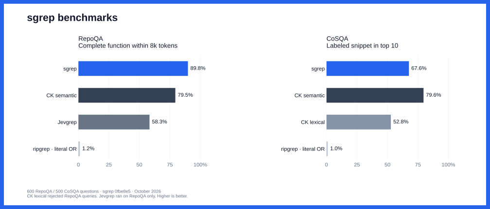

<p align="center">
  <a href="https://context.dev">
    <picture>
      <source media="(prefers-color-scheme: dark)" srcset="assets/context-logo-white.svg">
      
    </picture>
  </a>
</p>

<h1 align="center">sgrep</h1>

<p align="center">Search code and documents in plain English. Runs locally.</p>

## Install

Requires Rust 1.90 or later and ripgrep.

```sh
brew install ripgrep
cargo install --git https://github.com/context-dot-dev/sgrep --locked
```

Or download a [macOS Apple Silicon binary](https://github.com/context-dot-dev/sgrep/releases/latest).
Remove any older Python install with `uv tool uninstall sgrep` or `pip uninstall sgrep` first.

## Search

```sh
sgrep "when does a failed scrape consume credits" ./src
```

Results show the file, line range, and source. Use `-n 10` for ten results or `--json` for JSON output.

To rank only the results from ripgrep:

```sh
rg --json -C 3 'creditCost|shouldBill' ./src \
  | sgrep "when does a failed scrape consume credits" --stdin
```

Run both commands from the same directory. Use ripgrep for exact matches; sgrep can return approximate matches.

The first search downloads a model (32–34 MB) and any required code parsers. Later searches can run offline.
Source and queries stay on your machine. The local index stores copies of source passages.

## Benchmarks

[](benchmarks/README.md#full-retrieval-benchmark-october-9-2026)

600 RepoQA questions and 500 CoSQA questions. sgrep leads on complete-function retrieval; CK semantic leads on snippet retrieval.
[Results and method](benchmarks/README.md#full-retrieval-benchmark-october-9-2026).

## Reference

<details>
<summary>Search options</summary>

- `--stdin`: rank only the supplied ripgrep match and context blocks.
- `--rg-json FILE`: add saved ripgrep results to a search. Use `-` to read from stdin.
- `--model code` or `--model text`: select a model. Auto mode selects text when all candidate passages are prose, and code otherwise.
- `--json --explain`: include lexical, semantic, and combined scores.

Ripgrep paths are relative to the current directory. Files must be within the search path and match the current source.
Added ripgrep results can include hidden or ignored files. Normal searches follow ripgrep's ignore rules and skip hidden and binary files.

Auto mode treats `.md`, `.mdx`, `.txt`, `.rst`, `.adoc`, `.org`, and `.text` as prose. Extension matching ignores case.

Exit codes: 0 for results, 1 for no results, 2 for errors. Empty piped input returns `[]` with `--json`.

</details>

<details>
<summary>Cache controls</summary>

- `--refresh-cache`: rebuild the search index. Cached models allow offline use.
- `--no-cache`: search without reading or writing the index.
- `--cache-dir DIR`: store indexes, models, and parsers in one directory.
- `--fresh-assets`: use temporary model and parser downloads. Requires network access.
- `HF_HUB_OFFLINE=1`: prevent model and parser downloads.

Each search checks file content. Changes to files, ignore rules, or models invalidate the index.
Source is checked again before results are returned. Freeze files when you need repeatable measurements.
Piped ranking does not use the index.

The index cache has limits of 256 MiB and 128 entries. Cleanup removes the least recently used entries and entries unused for 30 days.
Set `SGREP_CACHE_MAX_BYTES` to change the size limit; use 0 to disable the index cache.
Large entries are not saved. Cache failures fall back to a search without the index.
Source copies remain until cleanup or manual deletion. Models and parsers are outside these limits.

Cache locations, in priority order:

- Index: `SGREP_CACHE_DIR`, `XDG_CACHE_HOME/sgrep`, `~/.cache/sgrep`.
- Models: `HF_HUB_CACHE`, `HUGGINGFACE_HUB_CACHE`, `HF_HOME/hub` (default `~/.cache/huggingface/hub`).
- Parsers: `TREE_SITTER_LANGUAGE_PACK_CACHE_DIR`, then the platform cache under `tree-sitter-language-pack/v<version>`.

`--cache-dir` overrides these paths. Index files have private permissions on Unix.
Model files are checked against pinned hashes. Parser downloads use archive checksums.
Temporary downloads are removed on normal exit; forced termination can leave files behind.
Refresh options do not clear the operating system's file cache.

</details>

<details>
<summary>How search works</summary>

Ripgrep lists files. Rust splits them into passages with Chonkie and Tree-sitter.
Code parsers support Python, C/C++, Go, Java, Rust, JavaScript/JSX, and TypeScript/TSX.
Other files use text splitting. Passages target 2,048 characters and keep whole lines.

Search combines the top 200 lexical matches with the top 200 semantic matches.
Each embedding uses the file path and passage text. Scores combine 75% semantic and 25% BM25 after scaling each to 0–1.
Exact, case-sensitive identifier matches rank first. In longer queries, this applies to names with camelCase, underscores, dollar signs, or digits.
Scores are relative to the candidates, not confidence values.
Piped mode ranks only the supplied passages. Results fully contained in earlier results are removed.

The models are [Minish Lab's](https://github.com/MinishLab) [Potion Code 16M v2](https://huggingface.co/minishlab/potion-code-16M-v2)
and [Potion Base 8M](https://huggingface.co/minishlab/potion-base-8M). Both use fixed revisions and an MIT license.

</details>

<details>
<summary>Development</summary>

```sh
cargo build --release --locked
PATH="$PWD/target/release:$PATH" python3 tests/e2e.py > e2e-results.json
PATH="$PWD/target/release:$PATH" python3 tests/codechunker.py > chunker-results.json
PATH="$PWD/target/release:$PATH" python3 tests/hybrid.py > hybrid-results.json
PATH="$PWD/target/release:$PATH" python3 tests/discovery.py > discovery-results.json
SGREP_BASELINE=/path/to/before SGREP_CANDIDATE="$PWD/target/release/sgrep" python3 tests/index.py > index-results.json
python3 tests/cache_lifecycle.py target/release/sgrep target/cache-lifecycle-results.json
python3 tests/cache.py target/release/sgrep target/asset-cache-results.json --online
```

These E2E checks use real models and save JSON receipts.
To compare builds, run `python3 tests/benchmark.py BEFORE AFTER queries.json results`.
Each query needs `id`, `query`, and an absolute `root` path. Add `--refresh-cache` to rebuild indexes before timing.

</details>

[MIT](LICENSE) · [Context.dev](https://context.dev)
