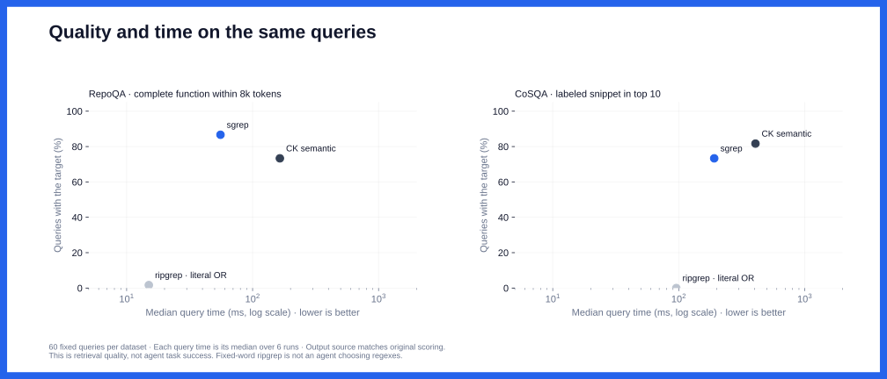
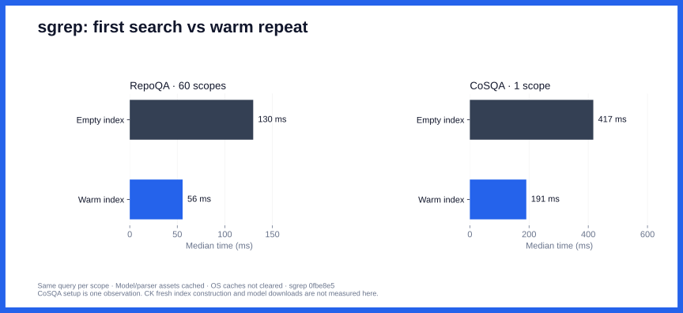

# Code-search benchmark

## Full retrieval benchmark (October 9, 2026)

600 RepoQA questions. 500 CoSQA questions. sgrep main at `0fbe8e5`, compared with CK, Jevgrep, and ripgrep.


RepoQA measures whether results contain the full target function within 8,000 source tokens. CoSQA measures whether the labeled snippet appears in the first ten results.

## Latency


120 fixed queries, six repeats, and 2,160 timed CLI calls. Models and indexes are warm. Median and p95 include process startup.

<details>
<summary>Sampling and timing</summary>

A separate replay on October 10 uses 60 RepoQA queries and 60 CoSQA queries, with six repeats per tool.
One query is selected by its ID's SHA-256 hash from each RepoQA repository; CoSQA uses the lowest 60 ID hashes.
Each call starts a new CLI process. The timed calls follow a preparation pass, with models and indexes cached.

Tool order rotates within each query. Dataset calls alternate, and query order changes each round.
All 2,160 timed calls run sequentially. No slow samples are removed.
This measures local end-to-end CLI time, including source checks and output, on a shared M5 Max.
It does not isolate embedding time or clear the operating system's cache.

</details>

CK lexical is omitted from this timing replay because it rejects the RepoQA descriptions.
Jevgrep's earlier concurrent, hosted timings are separate. mgrep is not measured; no authenticated installation was available.



Each point uses the same queries for quality and time. Quality comes from the saved scores; repeated outputs must match the same ranked source.
The time axis uses each query's median across six repeats, then the median across queries.
Ripgrep uses fixed query words, so this does not measure an agent choosing regexes.

<details>
<summary>Timing uncertainty and setup</summary>

The [latency analysis](full-suite/latency-analysis.json) reports paired time ratios and 95% bootstrap intervals.
It resamples the 60 query IDs, after collapsing repeats to per-query medians. It does not treat 360 calls as 360 independent queries.
These intervals describe this panel, not other machines or workloads.



Setup here means the first sgrep search in each scope with an empty index and cached model/parser assets.
RepoQA has 60 scopes; CoSQA has one. The CoSQA setup value is one observation, not a tail estimate.
CK reused existing indexes, so its fresh-build cost is not measured. First-time downloads and post-edit latency also need separate runs.
See [index storage and API usage](full-suite/setup-summary.json) for the earlier full run.

</details>

## Rank


On CoSQA, 132 of sgrep's 162 top-ten misses appear at ranks 11–100. Better ranking could help. This does not measure recall before reranking.

## Languages


100 questions per language. The target function must fit within 8,000 returned source tokens.

## What this measures

Keep four questions separate: did search find the target, did it return enough source, how long did it take, and what did setup cost?
A fast miss is still a miss. File rank alone does not show whether an agent has enough code to act.

This suite covers natural-language code discovery. It does not yet compare exact-name search, agent-chosen regexes, piped ranking, prose retrieval, or complete coding tasks.
Code and document modes therefore share no headline quality claim.

## Method

RepoQA uses all 60 supplied source snapshots. CoSQA uses all 500 test questions and 6,267 Python snippets.
The RepoQA measure adapts the dataset for retrieval; it is not the official code-generation score.
CoSQA has one labeled answer per question, so other valid answers may count as misses.
Both datasets were used during development.

CK lexical rejected all RepoQA queries and six CoSQA queries. These failures count as misses.
Jevgrep ran on RepoQA only; six partial searches remain included.
Ripgrep used a fixed literal-OR query, not patterns chosen by a person or agent.

<details>
<summary>Run details</summary>

- sgrep used `--model code --json`, with up to 50 passages on RepoQA and 100 on CoSQA.
- CK 0.7.11 used `bge-small`, native semantic or lexical search, and `--full-section --threshold 0`.
- Jevgrep used commit `703aba1` and TypeSafe `jev-1.13.0`. It had four query workers, a 180-second timeout, and a 1,000-request cap.
- ripgrep 15.2.0 matched query words without case sensitivity and sorted results by path.
- File ranks count distinct files. Source coverage uses `o200k` tokens and counts overlapping lines once.

Source hashes and returned lines were checked before publication. CK semantic omitted four target-query files; these count as misses.
Thirty Jevgrep searches were repeated after host sleep affected their clocks. All CK lexical searches were repeated after copied indexes were rebuilt.
These fixes did not select queries by score. Original attempts remain in the local evidence archive.

The original full-suite timing used one fresh process per query. Methods rotated; the CK lexical rerun ran separately.
Those single-pass timings remain in the CSV. The latency chart above uses the separate repeated panel.
The original rotation included another baseline that is omitted here. Full CK index build time was not measured.
See the [protocol](full-suite/protocol.json), [setup and usage](full-suite/setup-summary.json), and [paired comparisons](full-suite/paired-comparisons.json).

</details>

[Quality CSV](full-suite/summary.csv) · [5,000 scored runs](full-suite/results.json) · [Repeated latency samples](full-suite/latency-replay.json)

To check the totals and redraw the charts:

```sh
python3 benchmarks/full-suite/verify.py
# Requires matplotlib:
python3 benchmarks/full-suite/plot.py
```

This checks saved scores and timing summaries. It does not rerun the search tools.

<details>
<summary>Repeat the latency experiment</summary>

```sh
python3 benchmarks/full-suite/replay_latency.py /path/to/evidence-bundle /path/to/new-output
python3 benchmarks/full-suite/analyze_latency.py
```

The runner needs the original corpus, query, manifest, protocol, and native-record files. Set binary paths in that bundle's protocol for your machine.
Copied bundles also need their recorded absolute source paths remapped.
The bundle is retained locally; the checked-in receipt alone is not enough to rerun searches.
The runner checks pinned binaries and source hashes, saves its query selection before timing, and retains every native output.
It records errors, host load, clock gaps, and changes to ranked source. Review these before publishing a new receipt.
The analysis script reads the checked-in latency receipt; copy a validated new receipt there to analyze another run.

</details>

[Earlier measurements](https://github.com/context-dot-dev/sgrep/blob/cfb48d90c88cb92363b7b7e1a6403f575dc7dbc5/benchmarks/README.md#historical-measurements) use older builds, samples, and metrics.
