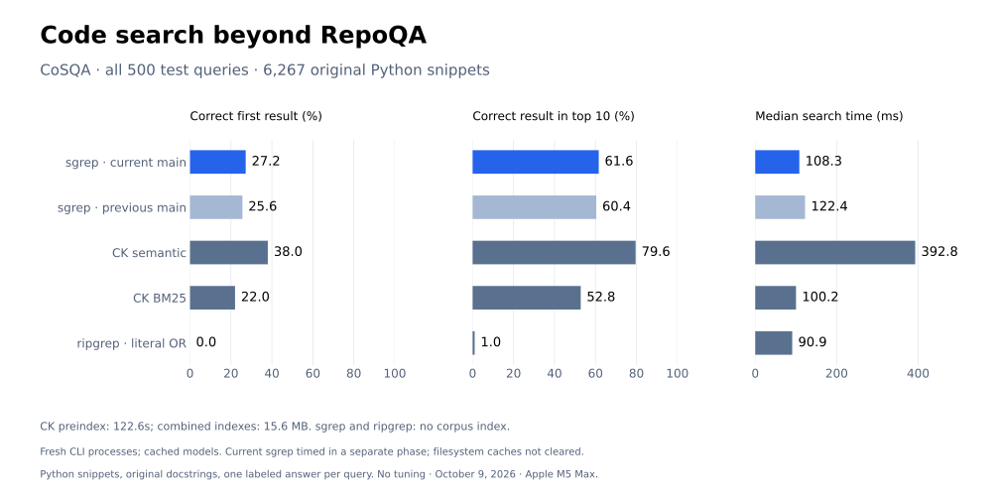
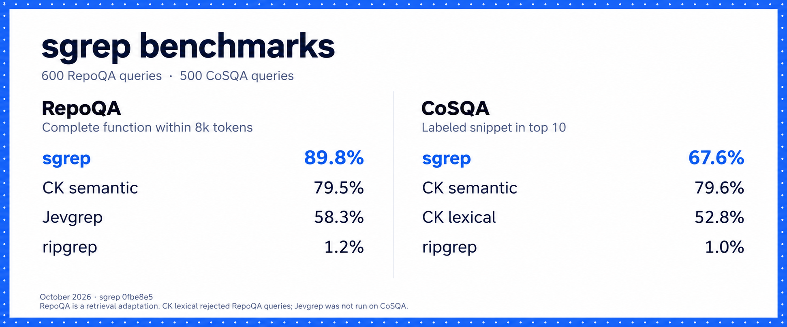
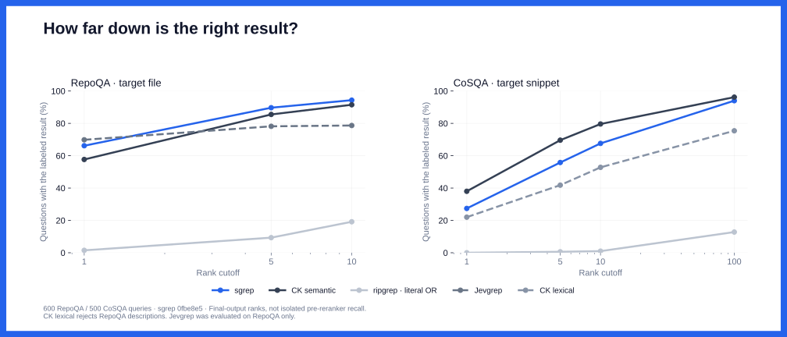
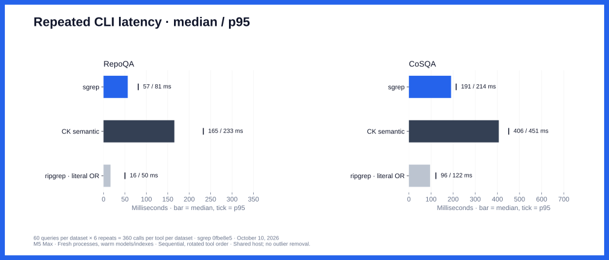
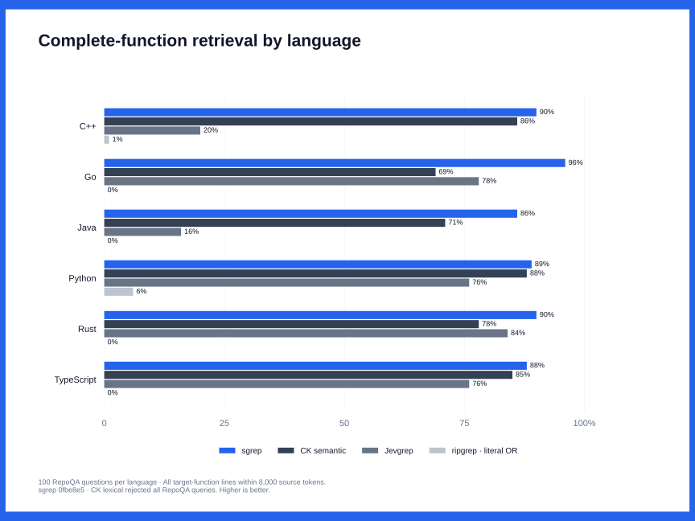

# Code-search benchmarks

## CoSQA: full retrieval test

[CoSQA](https://github.com/Jun-jie-Huang/CoCLR) provides real web-search queries paired with Python code. This October 9, 2026 comparison uses **all 500 test queries and all 6,267 original snippets** at upstream commit `14ebcacf9e9bc3e7109102632bc63047876f27d2`. The 500 queries refer to 472 distinct labeled snippets. No model or query tuning was performed.



| Tool | Hit@1 | Hit@5 | Hit@10 | MRR@10 | Median | p95 | Errors / 500 |
| --- | ---: | ---: | ---: | ---: | ---: | ---: | ---: |
| sgrep (current main) | 27.2% | 52.6% | 61.6% | 0.376 | 108.3 ms | 137.2 ms | 0 |
| sgrep (previous main) | 25.6% | 51.4% | 60.4% | 0.364 | 122.4 ms | 166.9 ms | 0 |
| CK semantic | 38.0% | 69.6% | 79.6% | 0.515 | 392.8 ms | 539.9 ms | 0 |
| CK BM25 | 22.0% | 41.8% | 52.8% | 0.309 | 100.2 ms | 139.4 ms | 6 |
| ripgrep (literal OR) | 0.0% | 0.6% | 1.0% | 0.002 | 90.9 ms | 129.0 ms | 0 |

Current sgrep improved Hit@10 from 60.4% to 61.6%, while CK semantic reached 79.6%. CK alone found the target in 120 queries; current sgrep alone did so in 30. sgrep had lower measured latency and required no corpus index.

Hit@k counts the labeled snippet among the first k distinct returned files. Repeated chunks occupy one rank. MRR@10 is reciprocal rank truncated at ten, with zero for a miss or error; it is **not** the original paper's full-corpus MRR. Results identify snippets, not source coverage within a token budget, so they are not directly comparable with the older RepoQA numbers below.

Every tool sees the same original code, including docstrings, in opaque hash-named files. Queries, labels, and logs remain outside the search directory. CK's empty `.ckignore` prevents generated comment text entering lexical retrieval. Native index inspection confirmed all 6,267 snippets: CK BM25 additionally stores that empty configuration document. Source hashes and returned paths are checked; malformed results and subprocess failures stay in the denominator.

### Conditions and limitations

- **sgrep:** starting `main` at `9594adc` and current `main` at `973b010`, both using Potion Code 16M v2 and `--model code --json -n 100`. The newer revision uses live hybrid score fusion. Retrieval implementation and dependencies are unchanged in this benchmark PR.
- **CK 0.7.11:** semantic mode uses `bge-small`; lexical mode uses its native BM25 search. Both use `--jsonl --full-section --threshold 0 --topk 100` and receive the original query unchanged. Native query-parser errors, including apostrophes in English queries, count as failures.
- **ripgrep:** case-insensitive literal OR of fixed sgrep-style query words, returning filenames in path order. This is a simple control, not an agent choosing targeted grep commands.
- **Timing:** 500 sequential fresh native CLI calls per method. The original four methods rotate order per query; current sgrep is a separate sequential phase after that comparison, so its latency comparison is less controlled. CLI startup and model loading are included; harness parsing is excluded. A separate development query warms each method. Models were cached, filesystem caches were not flushed, and background host load was not controlled. Apple M5 Max, 48 GiB RAM.
- **Setup:** CK's initial semantic index took 122.6s and 13.1 MB. Combined indexes after BM25 warmup/search used 15.6 MB. The first BM25 call took 0.337s, including lexical index construction; it is retained separately from query timings. sgrep and ripgrep need no corpus index.
- **Scope:** Python snippets totaling 1.93 MB, not complete repositories or large monorepos. CoSQA labels one answer per query, so valid alternatives can be undercredited. Pretrained-model overlap with this public dataset is unaudited. Jevgrep was not rerun on CoSQA.

### Evidence and reproduction

[cosqa-results.json](cosqa-results.json) contains aggregate and per-query scores, dataset/binary provenance, and raw-record hashes. [cosqa-protocol.json](cosqa-protocol.json) freezes the methodology. The stdlib-only [runner](cosqa.py) preserves every CLI invocation, stdout, stderr, timing, and error, and can regenerate scores without rerunning search. It refuses changed corpora, leaked metadata, and overwritten runs.

The code model/parser must already be cached for offline sgrep runs. Install ripgrep, then run from this repository:

```bash
COSQA_WORK="$(mktemp -d)"
git clone https://github.com/Jun-jie-Huang/CoCLR.git "$COSQA_WORK/upstream"
git -C "$COSQA_WORK/upstream" checkout 14ebcacf9e9bc3e7109102632bc63047876f27d2
npm install --prefix "$COSQA_WORK/tools" @beaconbay/ck-search@0.7.11
COSQA_CK="$COSQA_WORK/tools/node_modules/@beaconbay/ck-search/dist/bin/ck"
git clone https://github.com/context-dot-dev/sgrep.git "$COSQA_WORK/sgrep"
git -C "$COSQA_WORK/sgrep" checkout 9594adce03b5825bc9e8c617072a00878df45ed4
cargo build --release --locked --manifest-path "$COSQA_WORK/sgrep/Cargo.toml"
COSQA_SG="$COSQA_WORK/sgrep/target/release/sgrep"
python3 benchmarks/cosqa.py prepare --upstream "$COSQA_WORK/upstream" --output "$COSQA_WORK/run"
python3 benchmarks/cosqa.py index --output "$COSQA_WORK/run" --sgrep "$COSQA_SG" --ck "$COSQA_CK"
python3 benchmarks/cosqa.py run --output "$COSQA_WORK/run" --sgrep "$COSQA_SG" --ck "$COSQA_CK"
git -C "$COSQA_WORK/sgrep" checkout 973b01035968975ffaba7e6b428aaf636fffbaa6
cargo build --release --locked --manifest-path "$COSQA_WORK/sgrep/Cargo.toml"
python3 benchmarks/cosqa.py add-sgrep --output "$COSQA_WORK/run" --sgrep "$COSQA_SG" --ck "$COSQA_CK" --sgrep-commit 973b01035968975ffaba7e6b428aaf636fffbaa6
python3 benchmarks/cosqa.py score --output "$COSQA_WORK/run"
```

Raw outputs and interrupted diagnostics are retained in the local evidence directory, not hosted in this repository. The commands above create an equivalent evidence directory on another machine. Regenerate the chart with `uv run --with matplotlib python benchmarks/plot_cosqa.py`.

## Full retrieval benchmark (October 9, 2026)

**600 RepoQA questions, 500 CoSQA questions, 5,000 scored runs.** The sgrep column is the pinned main snapshot `0fbe8e5725f71667789be4a3abcea4e02f33afa4`. CK is 0.7.11 with `bge-small`; Jevgrep is `703aba1` with TypeSafe `jev-1.13.0`; ripgrep is 15.2.0. This publication compares one sgrep build with the alternatives.



### RepoQA

All 60 supplied source snapshots and six languages, with 100 questions per language. File@k ranks distinct returned files. Half/Full means at least 50%/100% of the target-function source lines within the stated 2,000/8,000 `o200k` token budget. Only native returned source counts; overlapping lines are deduplicated. This is a retrieval adaptation of RepoQA release2024-06-23, **not its official code-generation score**.

| Method | File@1 | File@5 | File@10 | MRR@10 | Half@2k | Half@8k | Full@8k |
|---|---:|---:|---:|---:|---:|---:|---:|
| sgrep (`0fbe8e5`) | 66.2% | 89.7% | 94.3% | 0.757 | 75.7% | 89.8% | 89.8% |
| CK semantic | 57.7% | 85.5% | 91.5% | 0.695 | 67.2% | 81.3% | 79.5% |
| CK lexical | 0.0% | 0.0% | 0.0% | 0.000 | 0.0% | 0.0% | 0.0% |
| ripgrep literal OR | 1.5% | 9.3% | 19.2% | 0.053 | 3.3% | 16.8% | 1.2% |
| Jevgrep | 69.8% | 78.2% | 78.7% | 0.735 | 56.3% | 58.5% | 58.3% |

CK lexical's 600 zero scores are native syntax rejections of the formatted descriptions, not a general BM25 quality result. CK semantic omitted four target-query files under its native indexing behavior; these remain misses. Six partial Jevgrep searches remain scored on the output actually returned. Jevgrep ranks the right file first most often, while sgrep returns complete source more often.

### CoSQA

All 500 official retrieval test queries from CoCLR commit `14ebcacf9e9bc3e7109102632bc63047876f27d2`, searched against all 6,267 original Python snippets with opaque filenames and original docstrings. Hit@k counts the single official positive among distinct returned snippets; plausible alternatives may be undercredited. Jevgrep was not evaluated on CoSQA.

| Method | Hit@1 | Hit@5 | Hit@10 | Hit@100 | MRR@10 |
|---|---:|---:|---:|---:|---:|
| sgrep (`0fbe8e5`) | 27.4% | 55.8% | 67.6% | 94.0% | 0.396 |
| CK semantic | 38.0% | 69.6% | 79.6% | 96.2% | 0.515 |
| CK lexical | 22.0% | 41.8% | 52.8% | 75.4% | 0.309 |
| ripgrep literal OR | 0.0% | 0.6% | 1.0% | 12.8% | 0.002 |

Six CK lexical syntax errors remain in the denominator. On CoSQA, 132 of sgrep's 162 top-ten misses already appear at ranks 11–100. This suggests an opportunity to improve ordering, but final-output Hit@100 is **not** a separately instrumented pre-reranker recall measurement.



### Latency, setup and usage

Fresh CLI processes with warmed models, parsers and OS caches, on an Apple M5 Max with 48 GiB RAM and 18 logical cores. Local methods ran sequentially in rotating order; CK lexical's corrected cohort ran separately. Background macOS load increased during CoSQA, so these are observational host timings rather than controlled laboratory speed claims. The original timing rotation also contained a baseline arm omitted from this publication.

RepoQA durations in milliseconds:

| Method | Median | p95 | p99 |
|---|---:|---:|---:|
| sgrep (`0fbe8e5`) | 52.8 | 69.2 | 101.4 |
| CK semantic | 147.4 | 181.8 | 272.4 |
| CK lexical | 10.2 | 25.6 | 100.0 |
| ripgrep literal OR | 14.9 | 45.7 | 66.8 |
| Jevgrep | 9513.4 | 35585.9 | 63286.4 |

CoSQA durations in milliseconds:

| Method | Median | p95 | p99 |
|---|---:|---:|---:|
| sgrep (`0fbe8e5`) | 239.3 | 1101.4 | 1207.7 |
| CK semantic | 486.6 | 2399.8 | 2556.4 |
| CK lexical | 229.1 | 321.8 | 455.0 |
| ripgrep literal OR | 118.4 | 623.4 | 730.9 |

RepoQA CK lexical times measure failed parsing, not successful search. Jevgrep durations include hosted inference and networking with normally four concurrent query workers and 32-request concurrency per query; they are not directly comparable to isolated local CLI timing.



- With cached model assets but empty scope indexes, sgrep's first search was 128.2 ms median / 218.7 ms p95 across the 60 RepoQA scopes, and 467.4 ms for CoSQA. These do not include first-time model downloads.
- sgrep index storage was 201.1 MB across both datasets. CK used 290.1 MB for RepoQA and 15.6 MB for CoSQA. Model/parser caches are excluded. CK semantic indexes were reused or incrementally built, so this run does not measure their full fresh-build cost.
- sgrep validates source content before and after indexed searches. That may contribute to CoSQA latency across 6,267 tiny files; this run does not isolate that cost. The CoSQA index retained its inode and content hash, confirming it was reused.
- Jevgrep's scored attempts used 21,141 API requests, 163,796,885 input tokens and 8,234,471 output tokens. Original sleep-affected attempts incurred additional usage. The provider did not return dollar cost. The warmed local methods made no per-query model API calls.

### Language breakdown

Complete target function within 8,000 source tokens, 100 questions per language:



### Methodology and verification

sgrep returned up to 50 passages on RepoQA and 100 on CoSQA using `--model code --json`. CK used native semantic/lexical modes with `--full-section --threshold 0` and matching top-k limits. Ripgrep used case-insensitive literal OR of query words, sorted by path; this is not an agent choosing precise regexes. Jevgrep used its native adapter with a 180-second timeout and a 1,000-request cap, which did not bind.

The full suite was frozen before scoring. Source hashes and every admitted result line were checked against the snapshots; independent rank replay found no disagreements. Jevgrep coverage uses only source visible in the native rendered output, respecting its output cap. These checks cover 60 source snapshots and 6,267 snippets.

Two measurement issues were corrected without selecting by outcome: 30 Jevgrep queries affected by synchronized host-sleep clock gaps were repeated after enabling a keep-awake assertion, and all 1,100 CK lexical queries were rerun after rebuilding copied indexes that retained old absolute paths. Original attempts were retained in the local evidence archive. Genuine parser errors and partial network results remain included. Empty `.ckignore` files prevent generated config prose from entering lexical search.

Both public datasets were inspected during prior development. This is regression evidence, **not a pristine held-out generalization claim**; model-training overlap is unaudited. Results apply to the supplied source snapshots, not complete production monorepos or general-document search.

The [paired comparison](full-suite/paired-comparisons.json) gives sgrep versus CK semantic a +10.3 percentage-point RepoQA Full@8k difference (95% bootstrap interval +6.0 to +14.8), and −12.0 points CoSQA Hit@10 (−16.4 to −7.6). RepoQA resamples whole repositories; CoSQA resamples queries, some sharing a positive snippet. These intervals do not account for dataset-selection bias or training overlap.

- [Scored rows, aggregates and language results](full-suite/results.json) · [CSV tables](full-suite/summary.csv)
- [Pinned binaries and protocol](full-suite/protocol.json) · [Setup, storage and usage](full-suite/setup-summary.json)
- [Aggregate replay](full-suite/verify.py) · [Deterministic chart renderer](full-suite/plot.py)

```sh
python3 benchmarks/full-suite/verify.py
# With matplotlib installed:
python3 benchmarks/full-suite/plot.py
```

The replay recomputes every aggregate and CSV value from all 5,000 published scored rows; it does not rerun models or revalidate source without the original local corpus. The overview is an image-to-image illustration checked against the tables. Ranking, latency and language SVGs are generated directly from the data.

## Historical measurements

The following sections retain earlier snapshots, smaller panels and different metrics for provenance. Their references to “current main” or “final release” refer to the versions measured at that time, not the full-suite snapshot above.


## Indexed discovery latency (October 9)

Warm Context searches now reuse chunks, lexical postings, and vectors without changing ranking. The final release was measured on the same 2,545-file, 85.8 MB snapshot, with cached models, fresh CLI processes, alternating arms, and no concurrent build/test jobs. Times include process startup and JSON serialization. The piped row includes ripgrep execution.

| Workload | Before | Indexed candidate |
| --- | ---: | ---: |
| Context discovery, target `main` (`973b010`), paired median | 456.9 ms | 62.5 ms |
| Context discovery, previous PR implementation (`aba33ff`), four per-query warm medians | 516–526 ms | 60.8–61.9 ms |
| Ripgrep → stdin reranking, previous PR implementation, warm median | 96.5 ms | 42.6 ms |
| First Context search with empty corpus cache, models cached | 2.78 s | 3.54 s |

The target-main comparison uses 20 paired calls across four questions; main does not support `--stdin`. The optimization comparison uses eight pairs per case, with the first pair reported separately: the slowest warm discovery call was 64.1 ms, and the slowest piped call was 44.7 ms. All 40 optimization pairs matched byte for byte, including scores. All 60 frozen RepoQA queries returned exactly the same top-50 results before and after optimization (39/60 correct-file@1, 52/60 complete-function within 8,000 characters). This preserves existing retrieval quality; it does not fix the four Context deciding-line misses described below.

The Context index is 257 MB (245 MiB) and contains source passages. Changed files trigger a full scope rebuild; cold and post-edit searches are not under 80 ms. Unix validation relies on file size, inode, modification time and change time, with a fresh ripgrep file listing; other platforms hash source too. These are local measurements, not a latency guarantee across repositories, filesystems, or machines. Raw timings, binary hashes, and conditions are in [index-results.json](index-results.json).

Reproduce paired timing and exact-output checks with:

```sh
HF_HUB_OFFLINE=1 SGREP_CACHE_DIR=/tmp/sgrep-index-bench \
  python3 tests/latency.py BEFORE AFTER cases.json results.json --repeats 8
```

Each case contains `name`, `cwd`, and `args`; add `input_command` for a producer such as `rg --json -C 3 ...`. Case definitions are retained in the result file; replace the snapshot-root placeholder with your local checkout. Use `aba33ff` for the exact-parity baseline, since independent discovery intentionally differs from target main. The earlier discovery measurements below predate this index optimization.

## Discovery and piped reranking (October 9)

The immediate target is now `973b010`, after the hybrid-fusion prerequisite merged as PR #3. Its executable sources are identical to the measured parent `6579a74`. The independent discovery/stdin change has this result on the same fixed 60 cases:

| Metric | Current main | Discovery/stdin |
| --- | ---: | ---: |
| Correct file in first passage | 39/60 | 39/60 |
| Correct file within five passages | 57/60 | 58/60 |
| At least half the target function within 8,000 characters | 51/60 | 53/60 |
| Complete target function within 8,000 characters | 51/60 | 52/60 |
| Cached median, isolated ABBA panel | 67.7 ms | 56.7 ms |
| First query per corpus median, model already cached | 69.1 ms | 103.8 ms |

The table below retains the cumulative comparison with the main version at the start of this task; its gains include the prerequisite and should not all be attributed to semantic discovery. Both comparisons and paired regressions are in [discovery-results.json](discovery-results.json).

This paired comparison uses the same 60 frozen queries and source snapshots, with `849a91c` as the baseline. The subsequent `9594adc` main commit changes only README/logo assets. No query-specific tuning was applied to this panel. Both executables return up to 50 source passages; every returned range was checked against the snapshot.

| Metric | Before | After |
| --- | ---: | ---: |
| Correct file in first passage | 34/60 (56.7%) | 39/60 (65.0%) |
| Correct file within five passages | 57/60 (95.0%) | 58/60 (96.7%) |
| At least half the target function within 8,000 characters | 48/60 (80.0%) | 53/60 (88.3%) |
| Complete target function within 8,000 characters | 48/60 (80.0%) | 52/60 (86.7%) |
| Cached query median, isolated ABBA panel | 76.6 ms | 56.8 ms |
| First query per corpus median, model already cached | 72.3 ms | 98.7 ms |

The coverage budget includes paths and complete source lines, measured in Unicode characters, **not the token budget in the older comparison below**. File ranks count passages, not distinct files. The latency panel runs one fixed query per repository twice per executable, in ABBA order, with fresh processes and cached models/corpus vectors. First-corpus timings are retained from the quality run and are less controlled; compilation overlapped part of that run. The candidate uses 12.5 MB of corpus-vector caches across the 12 snapshots. These caches are additional to model weights.

On the four previously investigated Context questions, whole-repository discovery still returned none of the four deciding lines in its top five, before or after. Targeted `rg --json -C 3 ... | sgrep ... --stdin` returned three of four. Those regexes came from prior source inspection, so this is an assisted workflow example, not a blind discovery score. On the 85.8 MB Context snapshot, the first candidate search took 3.3 seconds; subsequent searches took roughly 0.5–0.7 seconds, versus 0.35–0.44 seconds before. Piped reranking took roughly 90–115 ms including ripgrep.

The change enables retrieval without lexical overlap and useful piped reranking; it does not establish reliable reasoning about code conditions. The sample is small, previously published, and not newly held out. [Measurements and conditions](discovery-results.json) retain paired regressions as well as gains. The CLI runner retains every output and validates its source ranges:

```sh
python3 tests/retrieval_benchmark.py BEFORE AFTER queries.json /tmp/sgrep-comparison
```

Use the frozen query file from the evidence archive below (update its corpus paths for your host). Each query includes `id`, `query`, `root`, and `target: {path, start, end}`. The runner reports first-corpus and reuse timings separately; use an empty output directory for first-encoding measurements.


## Live hybrid fusion: before and after

On October 9, 2026, the new pipeline was compared with `origin/main` at `849a91c` on all **600 questions across 60 repositories and six languages** in the local RepoQA release2024-06-23 suite. Both versions use current code-aware chunking. This is a retrieval adaptation, not an official RepoQA model score.

| Metric | Before | After |
| --- | ---: | ---: |
| File@1 | 384/600 (64.0%) | 398/600 (66.3%) |
| File@10 | 564/600 (94.0%) | 566/600 (94.3%) |
| Half function@2k | 431/600 (71.8%) | 455/600 (75.8%) |
| Half function@8k | 507/600 (84.5%) | 533/600 (88.8%) |
| Complete function@8k | 507/600 (84.5%) | 533/600 (88.8%) |
| Median CLI latency | 80.7 ms | 68.9 ms |
| p95 CLI latency | 124.0 ms | 123.4 ms |

There were **32 complete-function gains and six losses**, and 31 file@1 gains versus 17 losses. All six lost function targets remain in the output but move beyond the 8k source-token budget. TypeScript complete-function coverage fell from 90% to 89%; the other language totals improved or stayed equal. No weights or thresholds were tuned against these questions.

The change combines corpus-wide BM25, equal-weight relative score fusion, complete static embeddings without padding/truncation, and retention of unique overlapping source. This measures the combined change, not score fusion in isolation. Optional agent-supplied ripgrep matches are covered by real CLI checks and are not used in this natural-language-only benchmark.

Both binaries use `--model code --json -n 50`. Returned source and corpus hashes are verified; source lines are deduplicated before applying the same 2,000/8,000 o200k token budgets. All 600 queries completed for both versions. Latency is measured separately with the existing 12-query panel, repeated three times per version in alternating order. Model and parser downloads are cached; filesystem caches are not cleared. Hardware: Apple M5 Max. These source snapshots do not establish cold-start or large-monorepo performance; the dataset was previously used and model training overlap is unaudited.

On the same 60-query subset used below, the current before/after comparison is 34/60 → 39/60 file@1 and 52/60 → 58/60 complete-function@8k. [hybrid-results.json](hybrid-results.json) retains all 600 paired scores, per-language results, source/binary provenance, record hashes, and the six regressions. The local full-output receipt and replay runner are in `artifacts/sgrep-hybrid-fusion-20261009` in the Context workspace; those paths require adjustment on another machine.

## Published v0.2.0 tool comparison


This is a retrieval adaptation of [RepoQA](https://github.com/evalplus/repoqa), evaluated on October 6, 2026. A fixed sample contains 60 function-description queries across 12 repositories and six languages: C++, Go, Java, Python, Rust, and TypeScript. It represents 10% of the 600-query release dated June 23, 2024, rather than an official RepoQA leaderboard score.

## Results

| Tool | File@1 | File@10 | Function@8k | Complete function@8k | Median | p95 |
| --- | ---: | ---: | ---: | ---: | ---: | ---: |
| sgrep | 53.3% | 91.7% | 76.7% | 66.7% | 71 ms | 91 ms |
| ripgrep | 0.0% | 16.7% | 15.0% | 1.7% | 23 ms | 41 ms |
| CK | 43.3% | 80.0% | 76.7% | 75.0% | 226 ms | 297 ms |
| Jevgrep | 75.0% | 80.0% | 60.0% | 60.0% | 10,183 ms | 16,965 ms |

File@1 and File@10 measure whether the target file appears within the first one or ten distinct files. Function@8k requires at least half the target function's lines within 8,000 o200k source tokens; complete-function coverage requires every line. Source lines are deduplicated in result order and verified against the snapshots.

Jevgrep has the best first-file accuracy. Its Java results often provide declaration locations without source excerpts, which score zero on source coverage even when the file is correct. CK and sgrep tie on half-function coverage, while CK returns complete functions more often. Ripgrep receives literal query words and returns matching lines in path order; this does not measure an agent constructing targeted grep commands.

## Conditions

Quality uses all 60 queries. Median and p95 latency come from a separate sequential replay of 12 queries, one per repository, after indexing and quality runs finish. All searches completed. The host was an Apple M5 Max with 48 GiB of memory; model downloads were cached and filesystem caches were not cleared.

- **sgrep v0.2.0** uses Potion Code 16M v2, `-n 50 --json`, and a fresh process with model loading included. The general-text model is not evaluated here.
- **CK v0.7.11** uses bge-small with `--sem --full-section --threshold 0 --topk 50`. Building its indexes took 411 seconds and 54.7 MB, excluded from search latency.
- **dzhng/jevgrep at `703aba1`** uses its native retrieval core with TypeSafe `jev-1.13.0`, concurrency 32, default rate budgeting, and no answer cache. Its resident Bun adapter excludes CLI startup. Timing covers the full retrieval pipeline, not a single model request.
- **ripgrep** uses case-insensitive literal OR matching of the same query words as sgrep, with `--sort path` and matching lines only.

Repositories and questions were selected by a fixed hash before scoring, with no subsequent tuning. The supplied snapshots total 12 MB, so these results do not establish large-monorepo performance. Python queries were previously available, and public-model training overlap has not been audited.

## Evidence and reproduction

[results.json](results.json) contains aggregate and per-query scores, the protocol, and record hashes. The [recorded-output archive](https://github.com/mrmps/sgrep/releases/download/v0.2.0/benchmark-evidence.tar.gz) includes queries, source manifests, native Jev output, runners, and reproduction instructions. The original runners retain machine-specific paths that must be adjusted for another host. Use the pinned RepoQA source snapshots rather than current repository checkouts.

To regenerate this graphic, install `matplotlib` and run `python benchmarks/plot.py`. The figure reads the checked-in results and includes Context's vector wordmark.

The [v0.2.0 verification receipt](https://github.com/mrmps/sgrep/releases/download/v0.2.0/verification.json) also records the separate Python-to-Rust comparison: median 397 → 74 ms, p95 834 → 129 ms, with all 100 ranked result lists unchanged.
